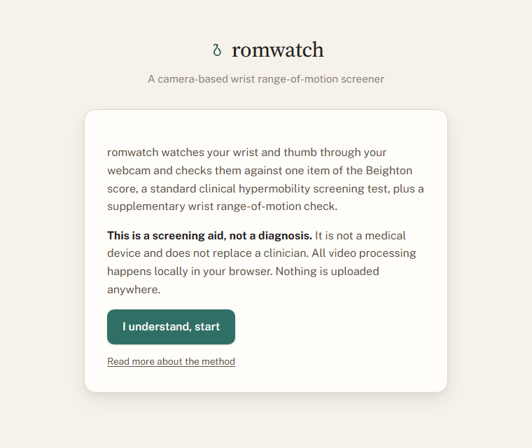
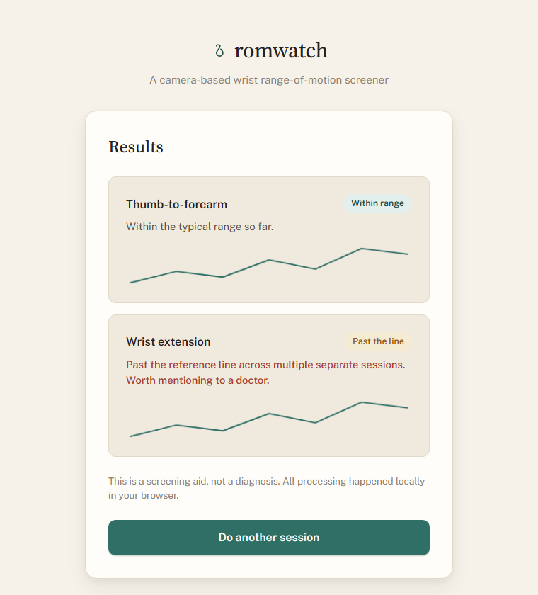

<div align="center">

# romwatch

**A camera-based hypermobility screener for two real Beighton score tests, running entirely
in your browser.**

[](https://siguatepeque.github.io/romwatch/)
[](https://siguatepeque.github.io/romwatch/docs/paper.html)
[](LICENSE)


[Try it](https://siguatepeque.github.io/romwatch/) •
[Why this exists](#why-these-tests) •
[How it works](#how-it-works) •
[Quick start](#quick-start) •
[Testing](#testing) •
[Limitations](#scope-and-limitations)

</div>

romwatch watches your hand through your webcam and guides you through two short movements:
bending your thumb toward your forearm, and bending your little finger back, both with your
other hand doing the pushing the way a clinician would. Both are real
clinical tests, the two upper-limb items of the **Beighton score**, the standard nine-point
exam clinicians use to screen for generalized joint hypermobility.

Every measurement runs on-device with [MediaPipe's Hand Landmarker](https://ai.google.dev/edge/mediapipe/solutions/vision/hand_landmarker).
Nothing is uploaded. Session history lives in your browser's local storage, nowhere else.

> [!IMPORTANT]
> **This is a screening aid, not a diagnosis.** It is not a medical device and does not
> replace a clinician. If it flags something, the right next step is a conversation with a
> doctor, not a conclusion drawn from a webcam. See the
> [methods and findings page](https://siguatepeque.github.io/romwatch/docs/paper.html) for the full methodology, the clinical sources it draws from, real-world testing findings,
> and an honest account of what it can and cannot measure.

## Screenshots

<table>
<tr>
<td width="50%">

**Disclaimer and start screen**



</td>
<td width="50%">

**Results screen** *(sample data, for illustration)*



</td>
</tr>
</table>

The live camera screen isn't pictured here since a static screenshot of your own hand mid-movement
doesn't demo well out of context. Run it yourself, see [Quick start](#quick-start).

## Why these tests

Most hypermobility screening happens in a doctor's office, if it happens at all. The
condition is frequently missed for years, especially in people whose joints just read as
"flexible" rather than as a pattern worth mentioning at a checkup. The thumb-to-forearm and
little-finger maneuvers are the two Beighton items a single camera watching a hand can
actually measure well, since neither requires tracking a joint the camera can't see (unlike
the elbow, knee, or trunk items). That's why they're the anchor of this project rather than
an invented substitute test.

## How it works

1. **Calibrate.** Hold up the hand you want tested, on its own, so the app can learn its
   size at a comfortable distance and know which of your two hands it's measuring. It won't
   start while both hands are in view, since it would have to guess between them. This
   becomes the reference for the framing checks that follow.
2. **Get framed.** Before each movement, the app checks that your hand is visible, not too
   close, not too far, and not clipped at the edge of the frame. It does not check the
   angle you hold your hand at, because the measurements don't depend on one: they're
   ratios between tracked landmarks, so a hand turned sideways or tipped toward the camera
   reads the same as one held square to it. Position in frame is free too, as long as the
   whole hand is inside it. The check only flags the cases where a reading would actually
   be unreliable, and says "Good, you're all set" the moment your position works.
3. **See what you're aiming for.** A real reference photo of the completed maneuver is
   shown next to the instructions, which stay on screen for the whole movement rather than
   being overwritten by live tracking feedback. An earlier version overlaid an animated
   ghost hand on the camera feed as a moving target; in practice a second hand-shaped
   outline on top of your own tracked hand read as confusing, not helpful, so it was
   removed in favor of the photo and the plain live skeleton.
4. **Hold.** Use your other hand to push the joint into position. Both of these are passive
   tests: in the clinic the examiner does the pushing, and what's being measured is the
   range the joint has when something else moves it, not what you can reach unaided. Two
   hands in frame is the expected state, and the app keeps measuring the hand you
   calibrated with rather than the one doing the pushing, even when they overlap. Each
   movement gets one attempt, and a second only if the first wasn't a clean positive, since
   the people most likely to be using this are exactly the people three or four repeat
   attempts are most tiring for. A repetition with poor tracking is discarded and retried
   rather than scored, since a bad reading is worse than no reading. Individual frames get
   dropped the same way and for the same reason: a hand turned to point straight at the
   camera makes the thumb reading numerically unstable, and a little finger that's curled
   rather than pushed back reads like hyperextension to a camera that can only see the size
   of the bend, not its direction. When frames are being dropped, the app says which of
   these it is.
5. **Watch the number, not just the verdict.** While you're holding the position, the app
   shows what it's currently measuring in plain language, along with the threshold that
   measurement has to clear ("thumb tip sits 38% of a palm length out from the wrist;
   the line is at 10%"), and draws the thumb test's pass/fail line right on the camera view.
   The recorded number shows up again next to each result. If the app ever disagrees with
   what you can plainly see your own hand doing, that's the number to quote when you
   report it.
6. **Read the result.** A single successful attempt is enough to score a maneuver positive
   for that session, matching how the real exam scores it. The recommendation only
   escalates to "worth mentioning to a doctor" once a maneuver has come back positive
   across three or more separate sessions, not from a single reading.

## Quick start

Camera access requires a secure or local context, so opening `index.html` directly as a
file won't work. Serve the folder instead:

```bash
git clone https://github.com/Siguatepeque/romwatch.git
cd romwatch
node serve.js
```

Then open **http://localhost:4173** in a browser with a webcam.

## Testing

```bash
node geometry.test.js   # pure geometry and scoring logic, no browser needed
npx playwright test     # structural end-to-end check with a fake camera device
```

The Playwright test drives a real Chromium instance with Chromium's fake camera device,
which has no hand in its synthetic feed. It confirms the app loads, the camera and
MediaPipe model initialize without errors, and the "no hand detected" framing state
displays correctly. It can't validate real gesture recognition accuracy, since there's no
hand in the test feed to recognize. That part was tested by hand, against an actual camera.

## Tech stack

- **No framework, no bundler.** Plain HTML, CSS, and JavaScript (ES modules) throughout.
- **[MediaPipe Tasks Vision](https://ai.google.dev/edge/mediapipe/solutions/vision/hand_landmarker)** for on-device hand landmark detection, loaded from a CDN.
- **`localStorage`** for session history. No backend, no database, no accounts.
- **[Playwright](https://playwright.dev/)** as the only development dependency, used for the end-to-end test above.

```
index.html    geometry.js   draw.js         tests/e2e.spec.js
style.css     poses.js      app.js          geometry.test.js
```

## Scope and limitations

This is a v1 focused on the two hand-only Beighton items, not a reimplementation of the
full nine-point exam. It doesn't attempt the other seven points of the score (elbow and
knee hyperextension, trunk flexion), which need different joints and in some cases a
full-body pose model to reach. It tracks one hand per session. There's no account system
or cross-device sync; history lives in that browser's local storage only.

See the [methods and findings page](https://siguatepeque.github.io/romwatch/docs/paper.html) for the complete methodology, the clinical literature it's grounded in,
what real-world testing found, the full list of limitations, and how each was addressed in
the design where it could be.

## Credits

Both reference photos are cropped from [Hypermobility Beighton Score.png](https://commons.wikimedia.org/wiki/File:Hypermobility_Beighton_Score.png)
by Rollcloud on Wikimedia Commons, dedicated to the public domain under [CC0 1.0](https://creativecommons.org/publicdomain/zero/1.0/).
No attribution was required, it's credited here anyway.

## License

[MIT](LICENSE)
